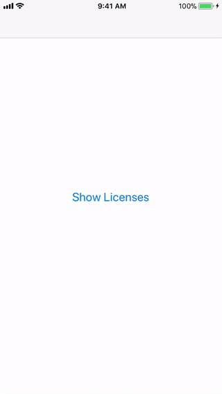

# Licenses
<p align="center">
    <a href="https://cocoapods.org/pods/Licenses">
        
    </a>
    <a href="https://cocoapods.org/pods/Licenses">
        
    </a>
    <a href="https://swift.org/package-manager">
        
    </a>
    <a href="https://twitter.com/mahmudahsan">
        
    </a>
</p>
Quick way to showcase 3rd party libraries and their licenses those are used to develop app.
Most of the open source license's common terms is that 
"The above copyright notice and this permission notice shall be included in all
 copies or substantial portions of the Software."
 
As normally when we develop app, we use several open source libraries. So this property list based UI library will help to easily integrate to showcase them in part of the app.
 
The UI is table view with 2 sections. First section contains the list of libraries details ( name, url, license ). And the second section contains the licenses name and urls.
 
 <p align="center">
    
</p>	

## Features

- [X] Showcase open source libraries name with licenses
- [X] Property List (.plist) based data integration
- [X] Delegate to integrate analytics
- [X] Works in iOS apps 

## Examples

Integrate within a UIViewController:
```swift
let bundle = Bundle(for: License.self)
let storyboard = UIStoryboard(name: "Licenses", bundle: bundle)

let licenseVC = storyboard.instantiateInitialViewController() as! LicensesViewController
licenseVC.title = "Licenses"
licenseVC.loadLicenseList(name: "licenses") // without .plist extension
//licenseVC.analytics = self 
self.navigationController?.pushViewController(licenseVC, animated: true)
```

licenses.plist file structure:
```xml
<?xml version="1.0" encoding="UTF-8"?>
<!DOCTYPE plist PUBLIC "-//Apple//DTD PLIST 1.0//EN" "http://www.apple.com/DTDs/PropertyList-1.0.dtd">
<plist version="1.0">
<dict>
	<key>libraries</key>
	<array>
		<dict>
			<key>title</key>
			<string>Appirater</string>
			<key>url</key>
			<string>https://github.com/arashpayan/appirater.git</string>
			<key>license</key>
			<string>MIT License</string>
		</dict>
		<dict>
			<key>title</key>
			<string>AppsPortfolio</string>
			<key>url</key>
			<string>https://github.com/mahmudahsan/AppsPortfolio</string>
			<key>license</key>
			<string>MIT License</string>
		</dict>
	</array>
	<key>licenses</key>
	<array>
		<dict>
			<key>title</key>
			<string>MIT License</string>
			<key>url</key>
			<string>https://opensource.org/licenses/MIT</string>
		</dict>
		<dict>
			<key>title</key>
			<string>Zlib License</string>
			<key>url</key>
			<string>https://opensource.org/licenses/Zlib</string>
		</dict>
	</array>
</dict>
</plist>

```

## Usage in an iOS application

Either

- Drag the folders Licenses/Sources folder into your application's Xcode project. 

or

- Use CocoaPods or the Swift Package manager to include AppsPortfolio as a dependency in your project.

```Ruby
pod 'Licenses', :git => 'https://github.com/mahmudahsan/Licenses'
```

* In your project create a new **licenses.plist** file and supply the libraries name, urls and licenses. Follow the licenses.plist file format provided in Licenses/Data.


## Questions or feedback?

Feel free to [open an issue](https://github.com/mahmudahsan/Licenses/issues/new), or find me [@mahmudahsan on Twitter](https://twitter.com/mahmudahsan).
