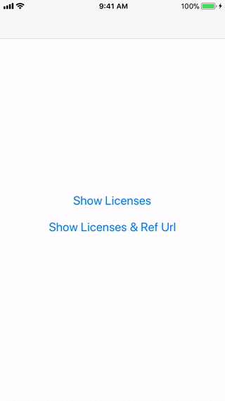
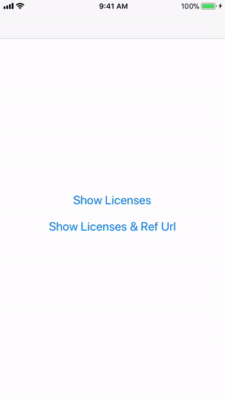

# Licenses
<p align="center">
    <a href="https://cocoapods.org/pods/Licenses">
        
    </a>
    
    <a href="https://cocoapods.org/pods/Licenses">
        
    </a>
    <a href="https://swift.org/package-manager">
        
    </a>
    <a href="https://twitter.com/mahmudahsan">
        
    </a>
</p>
<p>
Quick way to showcase 3rd party libraries and their licenses those are used to develop app.
Most of the open source license's common terms is that 
"The above copyright notice and this permission notice shall be included in all
 copies or substantial portions of the Software."
</p>
<p>
As normally when we develop app, we use several open source libraries. So this property list based UI library will help to easily integrate to showcase them in part of the app.
</p>
<p>
There are 2 ways to show credits by this library. If you selected .DESC style, then the license description provided by you will be shown. And .URL style, the url will be redirected when user click to see the license.
</p>
 
 <p align="center">
    
    
</p>	

## Features

- [X] Showcase open source libraries name with licenses
- [X] Property List (.plist) based data integration
- [X] Delegate to integrate analytics
- [X] Show license description or open url (2 ways)
- [X] Works in iOS apps 

## Examples Show Description

Integrate within a UIViewController:
```swift
let bundle = Bundle(for: LicensesViewController.self)
let storyboard = UIStoryboard(name: "Licenses", bundle: bundle)

let licenseVC = storyboard.instantiateInitialViewController() as! LicensesViewController
licenseVC.title = "Licenses"
licenseVC.loadLicenseList(name: "licenses", viewStyle: .DESC) // without .plist extension
//licenseVC.analytics = self 
self.navigationController?.pushViewController(licenseVC, animated: true)
```

## Examples Open Url

Integrate within a UIViewController:
```swift
let bundle = Bundle(for: LicensesViewController.self)
let storyboard = UIStoryboard(name: "Licenses", bundle: bundle)

let licenseVC = storyboard.instantiateInitialViewController() as! LicensesViewController
licenseVC.title = "Licenses"
licenseVC.loadLicenseList(name: "licenses", viewStyle: .URL) // without .plist extension
//licenseVC.analytics = self 
self.navigationController?.pushViewController(licenseVC, animated: true)
```

licenses.plist file structure:
```xml
<?xml version="1.0" encoding="UTF-8"?>
<!DOCTYPE plist PUBLIC "-//Apple//DTD PLIST 1.0//EN" "http://www.apple.com/DTDs/PropertyList-1.0.dtd">
<plist version="1.0">
<dict>
	<key>libraries</key>
	<array>
		<dict>
			<key>title</key>
			<string>Appirater</string>
			<key>url</key>
			<string>https://github.com/arashpayan/appirater.git</string>
			<key>license</key>
			<string>MIT License</string>
      <key>desc</key>
			<string>Copyright 2017. [Arash Payan] arash. This library is distributed under the terms of the MIT/X11.
While not required, I greatly encourage and appreciate any improvements that you make to this library be contributed back for the benefit of all who use Appirater.</string>
		</dict>
		<dict>
			<key>title</key>
			<string>AppsPortfolio</string>
			<key>url</key>
			<string>https://github.com/mahmudahsan/AppsPortfolio</string>
			<key>license</key>
			<string>MIT License</string>
      <key>desc</key>
			<string>...</string>
		</dict>
		</dict>
	</array>
</dict>
</plist>

```

## Usage in an iOS application

Either

- Drag the folders Licenses/Sources folder into your application's Xcode project. 

or

- Use CocoaPods or the Swift Package manager to include Licenses as a dependency in your project.

```Ruby
pod 'Licenses', :git => 'https://github.com/mahmudahsan/Licenses'
```
or
```Ruby
pod 'Licenses'
```

* In your project create a new **licenses.plist** file and supply the libraries name, urls and licenses. Follow the licenses.plist file format provided in Licenses/Data.


## Questions or feedback?

Feel free to [open an issue](https://github.com/mahmudahsan/Licenses/issues/new), or find me [@mahmudahsan on Twitter](https://twitter.com/mahmudahsan).
